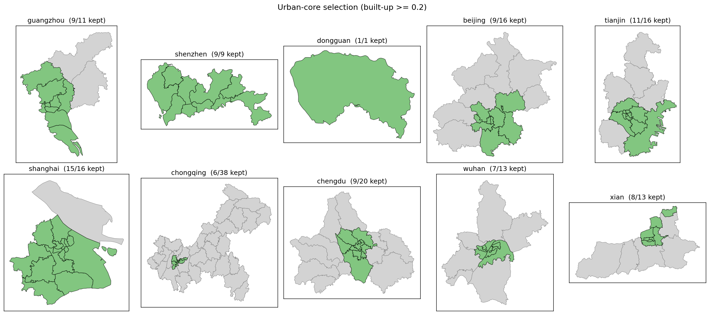
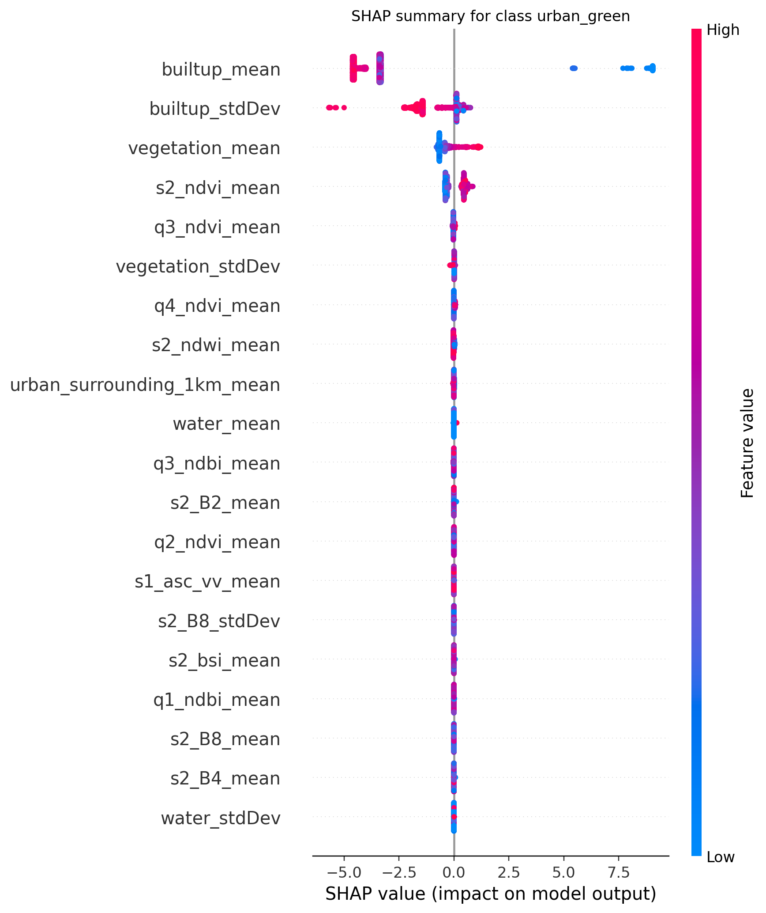
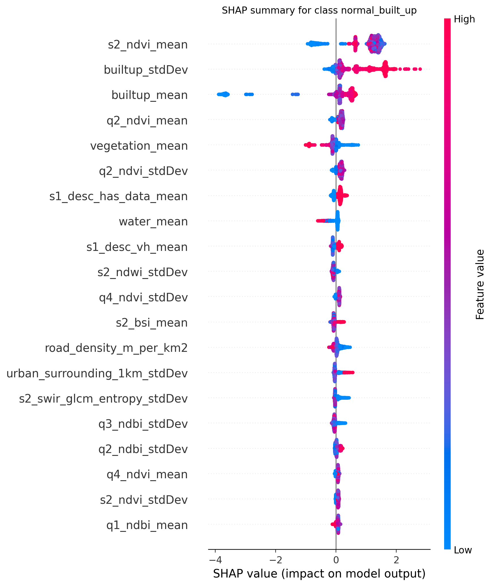
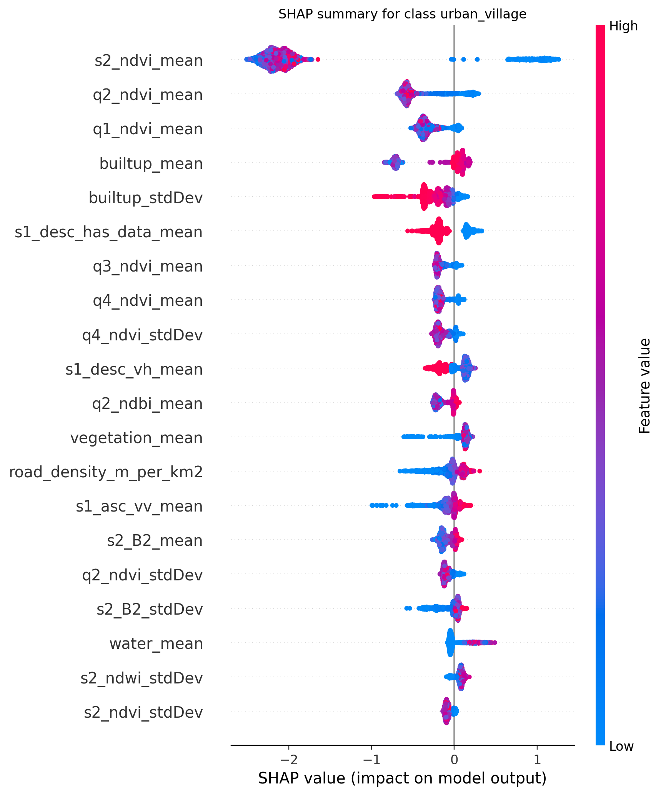
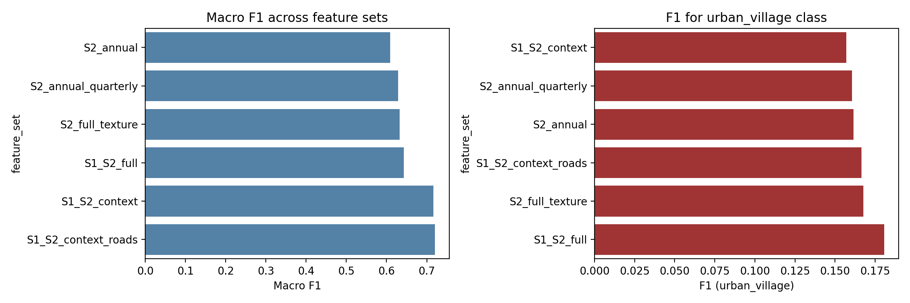
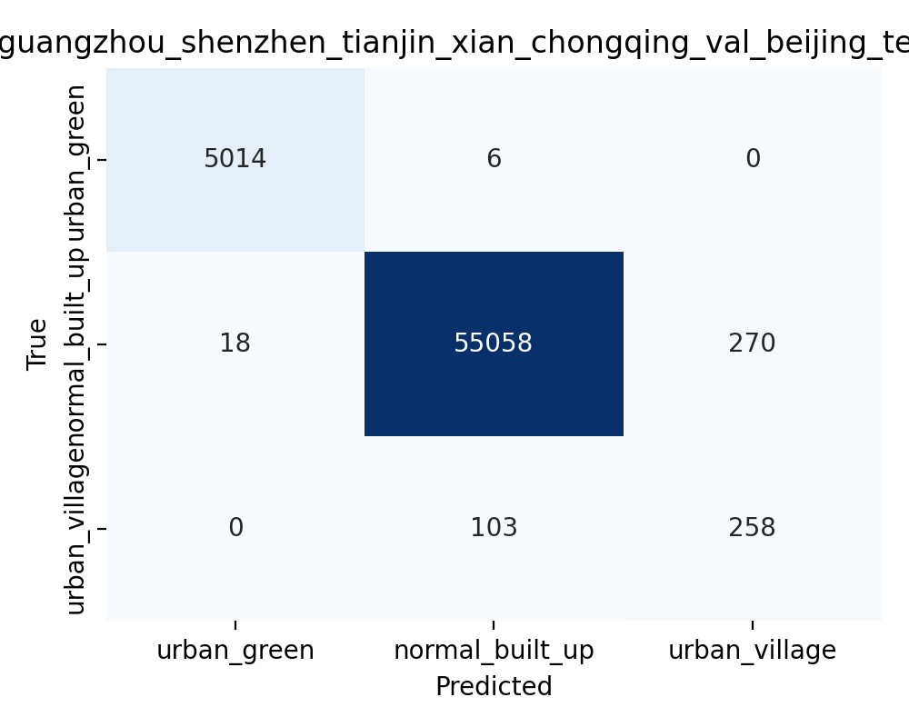

# **Evaluating the potential of multiple machine learning approaches for low-cost remote-sensing-only detection of Chinese urban villages**

## **1. Project Overview and Background Information**

Accompanied by the rapid urbanization process across the world, the inequality of development within modern cities is outstanding. The classical urban model, in which a central business district (CBD) is surrounded by a deteriorating inner 'zone of transition' or slum, was first set out by Burgess back in 1925. However, after 21st century, the skyrocketing growth rate of countless Global South countries has added new layers to that model. This is especially true in China, one of the fastest growing countries, which has lifted close to 800 million people out of extreme poverty over the past four decades (World Bank, 2022) and where 66.16% of the total population was living in cities by the end of 2023 (National Bureau of Statistics of China, 2024). Throughout this transformation, the inequality within cities has been comparatively neglected and not focused on.

In 2015, the United Nations adopted the 2030 Agenda for Sustainable Development, whose Goal 11 calls on countries to 'make cities and human settlements inclusive, safe, resilient and sustainable' (United Nations, 2015). After mass urbanisation, the inequality within fast developing cities cannot be ignored anymore. In China, the State Council issued its first dedicated guideline on urban-village redevelopment in 2023, initially targeting 35 mega and super-large cities. Since late 2024, this list has extended support to nearly 300 prefecture-level cities (General Office of the State Council, 2023). In 2025, the central authorities further designated the renewal of urban villages as a priority task within a nationwide urban-renewal action plan aiming for major progress by 2030 (General Office of the CPC Central Committee and General Office of the State Council, 2025).

### 1.1 What is Urban Village

An urban village (*chengzhongcun*, literally 'village within the city') is a formerly rural village that has been physically encircled by the rapid outward expansion of a Chinese city (Cao et al., 2025). China runs a dual urban-rural land system, and under this system, such villages keep their collectively owned rural land and their original household-registration based governance, even after the surrounding farmland has been urbanised or privatised. As a result, they sit largely outside the formal urban planning framework (Wang et al., 2009). The outcome is a dense, informal and often high-rise settlement. It supplies cheap rental housing to low-income rural migrants and the urban poor (Zhang, 2011).

### 1.2 Difference between urban village and slum

Although urban villages superficially resemble the slums, favelas and shantytowns of other developing countries, two key differences distinguish them. The first is tenure. Urban villages sit on collectively owned rural land on which villagers hold recognised property rights and build multi-storey 'handshake' housing, rather than squatting illegally on land they do not own (Wang et al., 2009). The second is origin. Urban villages are a deliberate and legally distinct outcome of China's dual urban-rural land system, not a product of state or housing market failure (Zhang, 2011). As a result, they are physically much closer to formal built-up fabric than classical slums are.

### 1.3 Difference between urban village and normal built-up area

Both urban villages and the surrounding formal built-up area appear as continuous, high-density urban fabric, which makes them hard to separate, especially in coarse remote-sensing data. The difference is one of morphology and planning. Formal built-up areas, such as residential compounds, commercial districts and industrial parks, follow planned street grids with building setbacks, wider roads and deliberate green and open space. Urban villages, built incrementally by villagers without unified planning, are far denser. It usually has tightly packed multi-storey 'handshake' buildings separated by narrow alleys, with minimal vegetation or open space (Wang et al., 2009).

### 1.4 What is the issue with urban village?

The first issue is safety. urban villages typically suffer from high public-health risks, frequent building and fire-safety hazards, poor supporting infrastructure and a degraded living environment (General Office of the State Council, 2023).

The second issue is social. As the cheapest foothold in the city, urban villages concentrate low-income rural migrants who, excluded by the household registration system, remain marginalised from formal urban services and welfares (Wang et al., 2009).

The third main issue is informational. Urban villages lack reliable, up-to-date geospatial data, which leaves planners without a clear picture of where they are and hinders evidence-based upgrading.

### 1.5 Why are we using satellite image to monitor urban village?

Field surveys and manual digitisation can identify urban villages accurately, but they are slow, expensive and quickly outdated, so they cannot keep pace with rapid redevelopment across many cities (Cao et al., 2025). Satellite imagery offers a scalable alternative, it covers entire cities consistently, is revisited every few days, and, through free public missions such as Sentinel-1 and Sentinel-2, incurs almost no data cost. Earth observation also has an established record of mapping informal settlements from their distinctive built-up texture and morphology (Kuffer et al., 2016), making it well suited to detecting the dense fabric of urban villages at scale. Specifically, the C-band VV and VH backscatter of Sentinel-1 is sensitive to the rough, volumetric scattering of densely packed buildings, while the short-wave infrared bands of Sentinel-2 (B11 and B12) and the grey-level texture derived from them best capture built-up materials and the fine-grained heterogeneity of the village fabric.

### 1.6 Why is machine learning suitable for analysing these satellite images? 

Separating urban villages from formal built-up areas is not a simple threshold problem. The distinction emerges only from subtle, non-linear combinations of many weak signals, such as SAR backscatter, SWIR texture, vegetation indices and urban context, which also vary from city to city. Machine learning is well suited to this setting because it can learn these high-dimensional, non-linear feature interactions directly from data, rather than relying on hand-crafted rules. It also supports cross-city generalisation, precisely the scalability and transferability that current urban-village mapping still lacks.

## **2. Existing Literature Review:**

Although urban villages are an established topic in urban planning and social science, the remote-sensing literature devoted to mapping them is suprisingly thin. The most recent systematic review, by Cao et al. (2025), records fewer than fifty peer-reviewed remote-sensing studies on Chinese urban villages across roughly two decades, with annual publication volume rarely exceeding five papers per year (Cao et al., 2025). 

! [picture]

By way of contrast, the broader literature on global slum and informal-settlement mapping reviewed by Kuffer et al. (2016) holds an order of magnitude more entries, and the follow-up critical review by Mahabir et al. (2018) extends this analysis to high- and very-high-resolution approaches. This volume gap is diagnostic rather than coincidental. The Chinese urban village is morphologically much closer to formal built-up fabric than to favela-style slums, so the standard slum-detection pipelines transfer to it only partially, and a parallel domain-specific literature has therefore developed slowly.

The urban-village-specific literature itself clusters into three methodological families.

**(i) Object-based image analysis (OBIA) on very-high-resolution (VHR) optical imagery.** 

The earliest and longest-running family, originating in the late 2000s as VHR Chinese imagery became available. A representative recent contribution is Zhao et al. (2020), who proposed a partition-based OBIA framework integrating a Random Forest classifier with GaoFen-2 imagery for Guangzhou, reporting an overall accuracy of 90.2% and Cohen’s κ = 0.80 across four re-divided administrative zones. However, these studies operate on commercial sub-metre imagery (typically GaoFen-2 or WorldView, with raw-data costs of roughly USD 10–30 per km²) and their segmentation rules and partition schemes require per-city manual tuning. None of the reviewed OBIA studies tests cross-city transfer, and the partition-based design in particular is explicitly tailored to the administrative geometry of a single region.

**(ii) Single-city semantic-segmentation with hand-labelled training data.** 

Since approximately 2020, the dominant approach has shifted to pixel-wise deep learning. Pan et al. (2020) trained a U-Net on WorldView satellite imagery for Guangzhou and reported strong building-level segmentation. Owusu et al. (2023) extended this line by inserting super-resolution generative adversarial networks (SR-GAN) as a preprocessor for multi-resolution chengzhongcun imagery. However, every paper in this family requires 200–2,000 hand-traced training polygons in a single study city, the annotation cost is rarely reported in the methods but is consistently the dominant cost of the work, and again no cross-city held-out evaluation is performed. The resulting models are therefore best understood as city-specific tools rather than transferable methods.

**(iii) The recent multi-source / multi-city frontier (2024–2025).** 

A new wave of work has begun to push past the single-city bottleneck. Zhang et al. (2024) introduced UV-SAM, an adaptation of Meta’s Segment Anything Model that produces fine-grained boundary masks across two Chinese cities and outperforms earlier baselines on both datasets. A flexible Sentinel-2-only deep-learning framework (Lin et al., 2025) employs a dual-branch encoder that fuses annual and seasonal imagery and reports mIoU = 0.83 with cross-city transfer tested within the Pearl River Delta. Most ambitiously, the CUGUV benchmark (Yao et al., 2025) released the first multi-city hand-curated urban-village dataset covering 15 Chinese cities for two years (2010 and 2020), and the accompanying Segformer model claims robust large-scale mapping performance. Similiarly, every paper in this frontier still depends on **hand-curated training labels**. CUGUV in particular reports thousands of hand-traced polygons across its 15-city sample. Although these works demonstrate transfer across handfuls of cities, the labelling effort scales linearly with the number of cities studied, so the fundamental cost barrier of manual digitisation is reduced but not removed.

Looking across all three families, and at the wider slum literature (Kuffer et al., 2016; Mahabir et al., 2018), four limitations comes up. First, **cross-city held-out evaluation is rare**. Many studies still report aggregate accuracy from within-city or weakly separated splits, rather than testing whether the model transfers to entirely unseen cities. Second, most studies still **classify each pixel or grid on its own**. This ignores the fact that urban villages cluster together in space, and spatial graph models that could use this clustering are absent from the reviewed work. Thirdly, **the imbalanced original data** is always ignored. Urban villages usually cover only 1–2% of the urban area. This is rarely treated as a core problem, so a high overall accuracy can still hide poor recall on the village class. Fourth, even the latest cross-city deep-learning methods (Zhang et al., 2024; Lin et al., 2025; Yao et al., 2025) **still need hand-labelled training data for every new city**. It remains unclear whether free, public weak signals could replace manual annotation altogether.

These four structural gaps—single-city evaluation, missing spatial inductive bias, unhandled data imbalance, and persistent dependence on manual labelling—together define the methodological space this project occupies, and motivate the specific research gaps set out below.

## **3. Current research gap**

i.  Despite the scale of the phenomenon, urban villages remain comparatively understudied, and the first comprehensive review of urban-village mapping in China appeared only recently.

ii.  Chinese urban villages differ fundamentally from the classical slums of other developing countries: built on collectively owned rural land, they are a deliberate product of the dual land system rather than illegal squatting, which makes them an institutionally distinct and more complex phenomenon (Zhang, 2011).

iii.  Methods developed for this setting have wider relevance, because informal and inadequate settlements are growing fastest across the rapidly urbanising Global South, particularly in Asia and sub-Saharan Africa (UN-Habitat, 2022).

iv.  There is still no unified definition of, or consensus method for, identifying urban villages, owing to persistent conceptual fuzziness and their spatial heterogeneity across cities.

v.  Existing mapping studies are largely confined to single cities or single images (e.g. Pan et al., 2020), and large-scale, cross-city benchmarks have only begun to emerge (Yao et al., 2025); the cross-city transferability of identification approaches therefore remains largely untested.

## **4. Research Question**

Building on the gaps above, this project asks one main question:

> **Can free, public satellite data combined with weak OSM supervision deliver a transferable urban-village classifier across 10 Chinese cities, without any manual annotation?**

This is broken down into two sub-questions:

1. **Signal** — Can multi-source Earth observation (Sentinel-1 SAR, Sentinel-2 optical and texture, and built-up context) separate urban villages from formal built-up areas and urban green at the 250 m grid scale?
2. **Models** — How do four machine-learning families (Random Forest, XGBoost, GraphSAGE, Gaussian Process) compare on this task, and does adding spatial structure (a graph) improve detection?

## **5. Data, Justification of the AOI selection and Platform Used**

### 5.1 City selection

The study covers 10 Chinese cities, organised into a 6-city training group and a 4-city held-out test group. The four first-tier cities (Beijing, Shanghai, Guangzhou, Shenzhen) and six second-tier cities (Tianjin, Chongqing, Wuhan, Chengdu, Xi'an, Dongguan) are listed below.

| Group | Cities | Role |
|---|---|---|
| Train | Guangzhou, Shenzhen, Tianjin, Beijing, Xi'an, Chongqing | Models fit on these |
| Test  | Dongguan, Shanghai, Chengdu, Wuhan | Never seen during training |

Beijing additionally serves as the inner validation city for GraphSAGE (Book 3), so the GNN sees only five training cities. The split is fixed across all four models so that headline metrics are directly comparable.

Three reasons motivate this 6/4 partition.

First, the first-tier cities (Beijing, Shanghai, Guangzhou, Shenzhen) are over-represented in existing research, while urban-village formation in fast-growing second-tier cities receives much less attention. Putting Dongguan, Chengdu and Wuhan into the test group forces the model to generalise into precisely the cities where new urban-village data are most needed.

Second, the ten cities collectively span the dominant Chinese settlement geographies: the Pearl River Delta (GZ, SZ, DG), the Yangtze River Delta (SH), the Beijing-Tianjin-Hebei region (BJ, TJ), the upper Yangtze (CQ, CD), the middle Yangtze (WH) and the inland north-west (XA). A model that transfers across these geographies has a reasonable claim to capture the *general* signature of urban villages rather than one city's idiosyncrasies.

Third, the train/test split is *spatial* (whole cities) rather than random within one city. This is the strict generalisation setting recommended for remote-sensing classification (Roberts et al., 2017), and is the setting in which most published urban-village models have not been benchmarked.

### 5.2 Data Sources

Five free, public data sources are used. All five are accessed at no cost.

| Source | Role | Resolution / coverage | Used in |
|---|---|---|---|
| **Sentinel-2 L2A** (Harmonised) | Optical reflectance + spectral indices | 10 m, 5-day revisit | Book 1 |
| **Sentinel-1 GRD** (IW mode, VV + VH) | C-band SAR backscatter + texture | 10 m, 12-day revisit | Book 1 |
| **ESA WorldCover v200** (2021) | Built-up class + 1 km urban-context smoothing | 10 m | Preprocess + Book 1 |
| **OpenStreetMap** (Geofabrik China PBF) | Weak supervision: `place=village/hamlet/locality`, `residential=rural`, `highway=*` | Variable, 2026 vintage | Book 0 |
| **China county/district administrative boundaries** (`CHN_level3_2024.shp`, 2853 districts) | Administrative AOI boundaries | National Bureau of Statistics 2024 vintage | Preprocess |

OSM is used only as the *source of weak labels*; it is never an input feature at inference time. This is the design choice that distinguishes this project from the methodological families surveyed in §2.

### 5.3 Area of Interest (AOI)

A naive city-administrative AOI would push the project far outside its intended remit. Full municipality boundaries include large mountain, farmland and peri-rural areas that are irrelevant to urban-village morphology. A preprocessing notebook (`pre-process/prepare_urban_aoi_from_gadm_l3.ipynb`) therefore filters the 2853 nationwide county/district polygons by an objective criterion: any district whose ESA WorldCover built-up fraction is at least 0.20 is retained, and the rest are dropped. The 0.20 threshold was selected after inspection so that urban-fringe districts where urban villages cluster (e.g. Tongzhou in Beijing, Binhai Xinqu in Tianjin, Lintong in Xi'an) are kept, while pure mountain or farmland districts are excluded. The script outputs a single GeoJSON (`urban_cores_by_builtup.geojson`) containing **84 retained district polygons** across the ten cities, which is then used as the *shared* AOI for both Book 0 (OSM extraction) and Book 1 (GEE feature export). Using a single shared AOI guarantees that every grid generated in Book 1 has matching OSM features within reach in Book 0, eliminating the spatial-join gaps that plagued earlier iterations.

### 5.4 Platforms

The project uses three free-tier platforms.

| Platform | Role |
|---|---|
| **Google Earth Engine (GEE)** | Sentinel-1, Sentinel-2 and WorldCover composite + grid-feature export (Book 1) |
| **Google Colab** (T4 GPU) | All Python notebooks: preprocessing, Book 0, Book 2, Book 3, Book 4 |
| **Geofabrik** | One-time China-wide OSM PBF download (~1.5 GB), cached on Drive |

No commercial imagery, no paid compute, and no manual annotation is used at any stage.

## **6. Methods**

The pipeline is organised as one preprocessing notebook and five computational books. The relationship between them is shown in the master flow chart below.

[*Figure: master flow chart of the 5-book pipeline*]

The first three stages (preprocess, Book 0, Book 1) build the data layer. The remaining three (Book 2, Book 3, Book 4) train and interpret the four machine-learning models.

### 6.1 Preprocessing — district-level AOI selection

[*Figure: preprocess flow chart*]

#### 6.1.1 Procedure

The notebook `pre-process/prepare_urban_aoi_from_gadm_l3.ipynb` performs four steps. It loads the `CHN_level3_2024.shp` county/district boundary file (2853 districts nationwide), filters by the 6-digit national administrative code to retain only districts inside the ten target prefectures, samples ESA WorldCover v200 directly from its public S3 bucket via GDAL `/vsicurl/` (no Earth Engine authentication required), and computes the built-up fraction (WorldCover class 50 over total valid pixels) for each district. Districts with built-up fraction >= 0.20 are retained. The 0.20 threshold deliberately includes urban-fringe districts where urban villages tend to cluster.

#### 6.1.2 Outcome

Of 153 districts in the ten target cities, **84 districts are retained** after filtering. The breakdown by city is given in `data/processed/builtup_filtered/urban_cores_by_builtup_summary.csv`, and a per-city sanity-check map is rendered automatically:



The script writes the kept districts to three formats: a GeoJSON (`urban_cores_by_builtup.geojson`) consumed by Book 0, a zipped Shapefile uploadable to Google Earth Engine as an asset and consumed by Book 1, and a summary CSV for the report.

### 6.2 Book 0 — OSM weak-label source extraction

[*Figure: Book 0 flow chart*]

#### 6.2.1 Procedure

The notebook `book0_osm/book0_final.ipynb` extracts OpenStreetMap features for use as weak supervision in Book 2. It downloads the daily Geofabrik snapshot `china-latest.osm.pbf` (about 1.5 GB) to Google Drive once and caches it. For each of the ten cities, the native command-line tool `osmium-tool` extracts a per-city PBF using the bounding box of that city's urban-core polygon, and the Python library `pyrosm` parses the per-city PBF in seconds. Three queries are run per city: `place = village / hamlet / locality` (the high-yield candidate signal), `residential = rural` (rare polygon hint) and the full highway network. All outputs are spatially clipped to the urban-core polygon so that OSM coverage matches Book 1 grid coverage exactly.

The design choice to use offline PBF parsing rather than the Overpass API was forced by experience. The public Overpass endpoints rate-limit and ban the Colab IP within minutes, which made earlier Overpass-based versions of Book 0 fail on 7 of 10 cities. The PBF route runs all ten cities in roughly 15 minutes end-to-end without any rate-limit risk.

#### 6.2.2 Outcome

For each city, two GeoJSON files are written: `osm_candidates/{city}_candidates.geojson` and `osm_roads/{city}_roads.geojson`. The final candidate counts range from 57 (Wuhan) to 1 750 (Beijing), and the road counts range from 27,875 (Xi'an) to 192,008 (Shanghai). The counts are sensible because Book 2's weak-label rules add built-up, urban-context and NDVI constraints that drop rural candidates downstream.

### 6.3 Book 1 — Google Earth Engine feature export

[*Figure: Book 1 flow chart*]

#### 6.3.1 Procedure

The script `book1_gee/book1_gee_export_grid_features.js` runs inside the Google Earth Engine Code Editor. For each city, it uses the urban-core polygon as the AOI and constructs a 250 m grid in the city's local UTM projection (EPSG 32648–32651, automatically dispatched to avoid Web-Mercator scale distortion at higher latitudes). For each grid cell it then reduces the following inputs to a per-cell `mean` and `stdDev` summary:

- annual Sentinel-2 surface reflectance for bands B2, B3, B4, B8, B11, B12;
- annual Sentinel-2 spectral indices NDVI, NDBI, NDWI, BSI;
- quarterly NDVI and NDBI for Q1–Q4 and the quarterly standard deviation, capturing seasonal variation that distinguishes year-stable urban-village rooftops from agricultural land;
- Sentinel-1 backscatter VV and VH for ascending and descending passes separately, with a 90 m kernel VV-texture for each pass and an `has_data` flag (some Chinese cities have only one S1 pass in 2025);
- a SWIR (B11) grey-level co-occurrence matrix at 90 m kernel for contrast and entropy;
- WorldCover classes built-up, vegetation, water, and a 1 km circular built-up smoothing as urban-context.

A grid cell is exported if either `builtup_mean ≥ 0.02` or `urban_surrounding_1km_mean ≥ 0.40`, so that urban-green cells (which have low built-up but high urban-context) are retained for the three-class problem in Book 2.

#### 6.3.2 Outcome

One CSV per city is exported to Google Drive, named `book1_grid_features_<city>_2025.csv`, with roughly 80 columns and a number of rows ranging from 10 860 (Wuhan) to 74 353 (Shanghai). Across the ten cities, **333 674 grid cells** are produced.

### 6.4 Book 2 — Three-class weak labels, RF and XGBoost

[*Figure: Book 2 flow chart*]

#### 6.4.1 Procedure

The notebook `book2_colab/book2_final.ipynb` joins Book 0 OSM and Book 1 EO features and produces the main classification result. Three steps are central.

First, a three-class weak-label rule is applied. The rule uses OSM proximity (distance to candidate, overlap) together with EO statistics (`builtup_mean`, `urban_surrounding_1km_mean`, `s2_ndvi_mean`) to assign each grid cell one of: 0 = urban green (low built-up, high NDVI, in urban context), 1 = normal built-up (high built-up, far from any OSM village candidate), 2 = urban village (high built-up, close to an OSM village candidate, very low NDVI), or −1 = ambiguous (any grid that does not satisfy any of the three rules). All ambiguous grids are dropped before training. The resulting class distribution is 8.8 % green, 90.1 % normal, 1.1 % village, a severe 82 : 1 imbalance between the majority and minority class.

Second, label leakage is explicitly prevented. The two OSM-derived columns used in the label rule (`dist_to_osm_candidate_m`, `osm_candidate_overlap`) are removed from the feature matrix X before training; otherwise the model can recover the rule trivially and achieve an artificially perfect F1. A defensive assertion in the ablation cell verifies that these columns are not in X.

Third, class imbalance is handled explicitly. The training set is resampled with SMOTE (Chawla et al., 2002), raising the village count from 1 043 to 10 000 and the green count from 6 229 to 15 000 while leaving the normal class at 59 900. SMOTE is fitted on training cities only; test cities are kept pristine. Random Forest (`class_weight = 'balanced'`) and XGBoost (`objective = 'multi:softprob'`) are then fitted on the resampled training set. Per-class precision, recall, F1, macro-F1, balanced accuracy, a 7-step feature ablation and per-class SHAP explanations are computed on the held-out test cities.

#### 6.4.2 Outcome

The headline metrics on the four held-out test cities are macro-F1 = 0.721 for Random Forest and macro-F1 = 0.719 for XGBoost, with urban-village F1 of 0.169 and 0.163 respectively. These results use SMOTE on the training cities only, while the held-out test cities remain untouched. The ablation results, the SHAP plots and the 3 × 3 confusion matrices are saved under `output/` and are reproduced in Section 7.

### 6.5 Book 3 — GraphSAGE graph neural network

[*Figure: Book 3 flow chart*]

#### 6.5.1 Procedure

The notebook `book3_gnn/book3_final.ipynb` reads the labelled grids produced by Book 2 and constructs a per-city k-nearest-neighbour graph (k = 8) using each grid's centroid in longitude / latitude. Edges are built within a city only; no edge crosses a city boundary, which would otherwise leak test-city structure into the training cities. The result is roughly **2.05 million directed edges** on 127,899 nodes.

The model is a two-layer GraphSAGE implemented in pure PyTorch (no PyTorch Geometric, to avoid Colab installation friction). Each layer concatenates a node's own features with the mean of its k = 8 neighbours' features and applies a linear projection. The classifier head is a linear layer producing three logits. Training uses cross-entropy with inverse-frequency class weights [13.0, 1.1, 75.8] for [green, normal, village], the AdamW optimiser (lr = 3 × 10⁻³), 300 epochs, and best-on-validation checkpoint selection using Beijing as the inner validation city.

#### 6.5.2 Outcome

GraphSAGE achieves macro-F1 = 0.858 and **urban-village F1 = 0.580** on the four held-out test cities, with urban-village precision at 0.489 and recall at 0.715. This is a 3.4x improvement over the Random Forest baseline. The trained model, the training history, the 3 × 3 confusion matrix and the per-grid prediction GeoJSON (with per-class probabilities and predictive entropy) are written to `output/`.

### 6.6 Book 4 — Gaussian Process uncertainty and calibration

[*Figure: Book 4 flow chart*]

#### 6.6.1 Procedure

The notebook `book4_gp/book4_final.ipynb` adds a fourth model family — a Gaussian Process Classifier — and evaluates uncertainty and calibration. Because the GP cost is O(n³), training is performed on a stratified subsample of 700 grids per class (2 100 grids total) using a fixed RBF kernel and one-versus-rest multi-class formulation. The trained GP outputs per-class probabilities and a predictive entropy per grid, both of which are saved as a GeoJSON map.

The notebook also computes reliability curves and Expected Calibration Error (ECE) for the GP and, when prediction maps are available, for the Book 2 RF/XGBoost outputs and the Book 3 GraphSAGE output. In the final run, the calibration table is produced for RF, XGBoost and GP.

#### 6.6.2 Outcome

The Gaussian Process subsample classifier achieves macro-F1 = 0.527 and urban-village F1 = 0.061. Its urban-village recall is very high (0.825) but at the cost of an extremely low precision (0.032) — almost every cell the model nominates as a village is wrong. The honest interpretation is that the small balanced subsample forces the GP to predict the minority class confidently in many places where it should not. The GP's value is therefore not its point predictions but the per-grid predictive entropy, which highlights the cells the model is least sure about (see §7.4). The GP is not well calibrated in this final run: its ECE is 0.440, compared with 0.018 for RF and 0.002 for XGBoost.

## **7. Results**

### 7.1 Headline cross-model comparison

The table below summarises the four model families on the same four held-out test cities (Dongguan, Shanghai, Chengdu, Wuhan, totalling 60 727 labelled test grids: 5 020 green, 55 346 normal, 361 village).

| Model | macro F1 | green F1 | normal F1 | **village F1** | village P | village R |
|---|---|---|---|---|---|---|
| Random Forest (with SMOTE) | 0.721 | 1.000 | 0.994 | 0.169 | 0.166 | 0.172 |
| XGBoost (with SMOTE) | 0.719 | 1.000 | 0.994 | 0.163 | 0.146 | 0.183 |
| **GraphSAGE (k = 8)** | **0.858** | 0.998 | 0.996 | **0.580** | 0.489 | 0.715 |
| Gaussian Process (subsample) | 0.527 | 0.661 | 0.860 | 0.061 | 0.032 | 0.825 |

Two observations stand out. First, the village-class F1 spans a factor of nearly ten across the four models, even though all four were trained on the same labels and features. The choice of model family matters more than any other single design decision. Second, the green and normal classes are handled equally well by every model that can be trained on them — the *only* meaningful contest is on the urban-village class, which is exactly the class the project sets out to detect.

The headline comparison is reported as a table because the corresponding CSV metric outputs were not copied into this repository.

### 7.2 Random Forest and XGBoost results (Book 2)

The two tabular baselines behave almost identically (macro-F1 within 0.003, village-F1 within 0.006). Both reach near-perfect green-class F1 because the green-class rule is the easiest of the three to recover from EO features alone. The bottleneck is the urban-village class: Random Forest catches 62 of 361 true villages (recall 0.17), XGBoost catches 66 (recall 0.18), and both produce many false positives in the normal-built-up class. SHAP confirms what should be expected: `builtup_mean`, `s2_ndvi_mean` and `builtup_stdDev` dominate the green-vs-rest decision, while `road_density_m_per_km2` and SAR backscatter contribute most to the village-vs-normal decision.










The ablation confirms that the full feature set (S2 annual + quarterly + GLCM SWIR texture + S1 ASC and DESC + WorldCover context + OSM road density) reaches macro-F1 = 0.720, whereas S2 annual alone reaches only 0.609. Each added source contributes monotonically, with the largest jump coming from adding WorldCover context.

### 7.3 GraphSAGE results (Book 3)



GraphSAGE recovers 258 of the 361 true urban-village grids (village recall 0.715) at a precision of 0.489, which is a 3.4x lift in F1 over Random Forest. The confusion matrix shows that the dominant error mode is *false positives in the normal-built-up class*: 270 normal grids are classified as urban village, not the other way around. This is the right direction of error for a deployment scenario in which a human verifier is willing to inspect candidate grids in the field — false positives can be filtered downstream, false negatives cannot.

The training history (saved in the Colab output directory as `book3_graphsage_training_history_*.csv`) shows the model converging steadily: village-class F1 rises from 0.135 at epoch 25 to 0.580 at epoch 300, with validation-city macro-F1 plateauing around epoch 275. The inner validation city (Beijing) prevents the test cities from being used for early stopping.

### 7.4 Gaussian Process result and uncertainty (Book 4)

The Gaussian Process classifier trained on a stratified 2 100-grid subsample produces a probability and entropy estimate for every test grid, but its probabilities are not well calibrated in the final run. Its point-classification performance is weak (macro-F1 = 0.527, village-F1 = 0.061), because the balanced subsample inflates the prior on the village class and the model accordingly over-predicts villages everywhere. This is, however, the *expected* trade-off when an algorithm with O(n³) cost is forced to use a tiny stratified sample.

The interesting GP output is therefore not the point classification but the **per-grid predictive entropy**. Entropy is highest in two characteristic locations: at the boundary between dense formal residential compounds and the urban-village fabric they have grown around, and in industrial / port-side grids where the spectral signature is ambiguous. These are precisely the grids on which a human reviewer should focus. The map is intended to be inspected interactively in QGIS rather than read as a printed figure.

The calibration outputs (`book4_calibration_ece_*.csv` and `book4_reliability_bins_*.csv`) record the reliability analysis in the Colab output directory. The main performance comparison is assembled from the metric CSVs written by Books 2, 3 and 4.

### 7.5 Spatial prediction output

Aggregating across all four test cities can hide important spatial variation, even when a formal per-city metric table is not produced. Book 3 therefore exports a grid-level GraphSAGE prediction CSV and GeoJSON containing each cell's city name, weak label, predicted class, per-class probabilities and predictive entropy. This output allows the held-out cities to be inspected independently in QGIS.

The full GraphSAGE prediction GeoJSON is too large for normal GitHub version control, so it is not embedded as an image here. A QGIS-rendered PNG should be added to `figures/` if a static map is needed in the final submission.

## **8. How to Use this and Repository Structure**

### 8.1 How to reproduce

The pipeline is designed so that a reader with a Google account and ~3 GB of Drive can reproduce every result from scratch in roughly four hours. The order is fixed.

1. **Clone the repository** and upload its `data/raw/CHN_level3_2024.{shp,shx,dbf,prj,cpg}` files to `/content/drive/MyDrive/0069/week10/data/raw/`.
2. **Run** `pre-process/prepare_urban_aoi_from_gadm_l3.ipynb` in Colab. Expected runtime: 5–15 minutes (one-time WorldCover sampling). Output: `urban_cores_by_builtup.geojson` and a zipped Shapefile.
3. **Upload** the zipped Shapefile produced in step 2 to **Google Earth Engine Assets**. Note the asset id (e.g. `projects/<your-project>/assets/0069/urban_cores_by_builtup`).
4. **Run** `book0_osm/book0_final.ipynb` in Colab. First run downloads `china-latest.osm.pbf` (~1.5 GB, ~10 minutes). Subsequent runs reuse the cached PBF. Expected total: 15–25 minutes.
5. **Open** `book1_gee/book1_gee_export_grid_features.js` in the Google Earth Engine Code Editor, set `CITY_BOUNDARY_ASSET` to the asset id from step 3, set `EXPORT_ALL_CITIES = true`, and click *Run* → *Run All Tasks*. Expected total: 5–20 minutes per city, run in parallel.
6. **Run** `book2_colab/book2_final.ipynb` in Colab. Expected runtime: 25–40 minutes.
7. **Run** `book3_gnn/book3_final.ipynb` in Colab (T4 GPU required). Expected runtime: 10–20 minutes.
8. **Run** `book4_gp/book4_final.ipynb` in Colab. Expected runtime: 5–15 minutes.

Colab writes full outputs to `/content/drive/MyDrive/0069/week10/outputs/`. The GitHub repository keeps only lightweight report figures under `figures/`; the large generated GeoJSON prediction layers are excluded from version control.

### 8.2 Repository structure

```text
0069_coursework/
├── README.md                         this file
├── COURSEWORK_PLAN.md                project planning notes
│
├── pre-process/
│   └── prepare_urban_aoi_from_gadm_l3.ipynb         preprocess
│
├── book0_osm/
│   └── book0_final.ipynb
│
├── book1_gee/
│   └── book1_gee_export_grid_features.js
│
├── book2_colab/
│   └── book2_final.ipynb                            RF + XGB
│
├── book3_gnn/
│   └── book3_final.ipynb                            GraphSAGE
│
├── book4_gp/
│   └── book4_final.ipynb                            Gaussian Process uncertainty
│
├── figures/
│   ├── fig01_urban_core_aoi.png
│   ├── fig02_rf_confusion_matrix.png
│   ├── fig03_xgb_confusion_matrix.png
│   ├── fig04_feature_ablation.png
│   ├── fig05_shap_urban_green.png
│   ├── fig06_shap_normal_built_up.png
│   ├── fig07_shap_urban_village.png
│   └── fig08_graphsage_confusion_matrix.png
│
├── data/
│   ├── raw/
│   │   └── CHN_level3_2024.{shp,shx,dbf,prj,cpg}    national-level admin boundary
│   └── processed/
│       └── builtup_filtered/
│           ├── urban_cores_by_builtup.geojson       shared AOI
│           ├── urban_cores_by_builtup_summary.csv
│           └── urban_cores_by_builtup_map.png
│
└── output/                                           local generated outputs
                                                      (ignored by Git except if copied manually)
```

## **9. Environmental Cost Assessment**

### 9.1 Why this section exists, and its link to the UN SDGs

A project that maps urban villages in service of UN Sustainable Development Goal 11 (sustainable cities and human settlements) should not be silent about its own carbon cost. SDG 13 (climate action) places this responsibility on any researcher who runs compute. The block below quantifies that cost, places it in everyday terms, and is then honest about what the measurement does not cover.

### 9.2 Measured emissions from model training

CodeCarbon (Schmidt et al., 2021) was embedded inside Books 2, 3 and 4 to log the energy used by model training on Google Colab's T4 GPU, and to convert that energy into kilograms of CO₂-equivalent based on a Europe-average grid carbon intensity. The recorded values are:

| Notebook | Activity | kg CO₂e |
|---|---|---|
| Book 2 | Random Forest + XGBoost fit | 1.9 × 10⁻³ |
| Book 3 | GraphSAGE training (300 epochs, GPU) | 1.1 × 10⁻³ |
| Book 4 | Gaussian Process fit (n = 2 100) | 5.4 × 10⁻⁵ |
| **Total** | | **≈ 3.1 × 10⁻³ kg CO₂e** |

Roughly 3 grams of CO₂-equivalent for the entire model-training run. Three relatable equivalents:

- about **0.4 smartphone charges** (at 8 g CO₂e per full charge, Belkhir & Elmeligi 2018);
- about **20 metres** of driving an average European petrol car (at 130 g CO₂e per km, EEA 2024);
- about **75 minutes** of one mature broad-leaf tree's annual CO₂ uptake (at 22 kg CO₂ per tree per year, UN-REDD 2017).

### 9.3 What this number does not include — and an honest accounting

The 3 g CO₂e figure covers *only* the model-training step on Colab. It excludes four other contributors which, taken together, dominate the real footprint.

1. **Google Earth Engine backend.** Every grid-feature export in Book 1 runs on Google's infrastructure outside the Colab session and is not measurable by CodeCarbon. GEE's own carbon disclosure is at the data-centre level rather than the job level.
2. **Data download.** The one-time 1.5 GB Geofabrik PBF download has an embodied transport cost that depends on the requester's network and the CDN edge node serving it.
3. **Storage.** The output GeoJSONs, intermediate PBFs and cached imagery on Google Drive consume passive storage energy for as long as the files exist.
4. **AI-assisted development.** Building the notebooks involved many queries to large language models. A single GPT-class query has been estimated at ~2 g CO₂e (Strubell et al., 2019, scaled to inference). 

Even when these four contributors are included, the total project cost almost certainly remains under one kilogram of CO₂-equivalent — comparable to a single short bus trip in central London. The point of this section is therefore less to claim a low number than to set the expectation that such accounting *should always be reported* in AI4EO work.

### 9.4 Environmental and social benefits

The headline counter-balance is methodological. The pipeline produces a multi-city urban-village classifier without commissioning any new sub-metre satellite imagery (each km² of which has a non-trivial launch and operations embodied cost) and without commissioning any manual annotation work (each hour of which has its own salaried and infrastructural cost). To the extent that the method scales, it substitutes free public data and ~3 g of training CO₂e for what would otherwise be an open-ended labelling exercise across hundreds of Chinese cities.

## **10. Discussion and Limitations**

### 10.1 What the project shows, and what it does not

The project shows three concrete things. First, that EO-only weak supervision *can* produce a non-trivial cross-city urban-village classifier — GraphSAGE on four held-out cities reaches village-F1 = 0.58, a number that has no published cross-city baseline to compare against. Second, that the choice of model family matters far more than the choice of features once class imbalance is handled. The same Sentinel-1 + Sentinel-2 + WorldCover + OSM-road-density feature stack moves village-F1 from 0.17 (Random Forest) to 0.58 (GraphSAGE) — a 3.4x swing driven entirely by the spatial inductive bias of message-passing on a k-nearest-neighbour graph. Third, that the Gaussian Process experiment is more useful as an uncertainty screen than as a point classifier: it has high recall but poor precision and poor calibration.

What the project does *not* show is the absolute accuracy of urban-village mapping against hand-verified ground truth, because no such ground truth was produced. The reported numbers measure agreement against weak labels, not against reality. §10.3 discusses this limitation in detail.

### 10.2 Comparison with existing literature

Directly comparable numbers are not available, because, as §2 noted, no published study evaluates urban-village mapping on a 4-city held-out test set with EO-only weak supervision. The closest reference points are: Pan et al. (2020) reaching ~0.88 building-level F1 on hand-labelled WorldView data in *one single* city, Zhao et al. (2020) reaching overall accuracy 0.90 on hand-labelled GaoFen-2 data in *one* city as well, and Zhang et al. (2024) UV-SAM reaching strong boundary IoU on *two* cities. All three use manual annotation and all three either evaluate on the same city used for training or report aggregate accuracy that does not isolate per-test-city performance. The GraphSAGE result here trades absolute accuracy for the absence of any hand-labelling step and the presence of strict cross-city held-out evaluation.

### 10.3 Limitations

1. **Weak labels are not ground truth.** Every reported F1 is agreement with the weak-label rule, not agreement with reality. The rule combines OSM proximity, ESA WorldCover built-up density, and Sentinel-2 NDVI; a grid that satisfies these constraints is labelled urban village, but a human inspector might disagree, especially at the boundary with normal built-up.
2. **The class-imbalance treatment is partial.** SMOTE (Book 2) and inverse-frequency class weights (Book 3) both compensate for the 1.1 % urban-village prevalence, but neither *solves* it. An additional 30 % of urban-village grids on the test cities are predicted as normal built-up by GraphSAGE.
3. **The "ambiguous" class is large.** About 60 % of all grids in the urban-context AOI fail to meet any of the three rule clauses and are dropped from training. Some of these are real urban villages that the rule simply cannot describe; the project does not quantify how many.


## **11. Future Work**

Three directions would extend this project usefully.

The first is **manual validation**. A subset of 200–500 grids drawn from `output/book2_v3_manual_validation_sample_*.geojson`, hand-labelled by a single trained annotator on Esri or Tianditu basemap, would convert the project's weak-label F1 into a defensible absolute accuracy figure. The cost is a few hours of annotation per test city.

The second is **graph-aware sampling under imbalance**. GraphSMOTE (Zhao et al., 2021) and BorderlineSMOTE for graphs interpolate synthetic minority nodes *and* synthesise their edges, which is the operation SMOTE-on-features alone cannot do. Applying GraphSMOTE to the kNN graph used in Book 3 would test whether spatial oversampling of the minority class lifts GraphSAGE precision without sacrificing its high village-class recall.

The third is **a finer-resolution boundary layer**. Due to the computational power limit from my free google account, the current pipeline classifies at 250 m, which is appropriate for *location* but too coarse for *boundary*. A second-stage pipeline that takes each "village" grid identified by GraphSAGE and refines its boundary using S2 10 m NDBI and SAR texture would produce maps directly usable by urban planners.

## **12. Conclusion**

The motivating question of this project was whether free public satellite data combined with weak OpenStreetMap supervision can produce a transferable urban-village classifier across Chinese cities without commissioning any new imagery, any new annotation, or any paid compute. The answer is a qualified *yes*. GraphSAGE on a 250 m grid graph trained against a three-class weak-label rule reaches macro-F1 = 0.858 and urban-village F1 = 0.580 on four held-out cities (Dongguan, Shanghai, Chengdu, Wuhan), a 3.4× lift over the tabular Random Forest and XGBoost baselines on the same data. The result is not a deployment-ready map: the absolute accuracy is bounded by weak-label noise and the residual class imbalance. But it is the first reproducible cross-city evidence in this literature that *spatial message-passing on a graph* is the inductive bias the urban-village classification problem actually needs, and that this signal can be captured without any manual annotation step. The wider methodological lesson — that the four recurrent gaps identified in §2 (single-city evaluation, missing spatial inductive bias, unhandled class imbalance, and dependence on manual labelling) can be addressed simultaneously rather than one at a time — is the principal contribution of this work.

## **References**

Belkhir, L. and Elmeligi, A. (2018) 'Assessing ICT global emissions footprint: Trends to 2040 & recommendations', *Journal of Cleaner Production*, 177, pp. 448–463. Available at: https://doi.org/10.1016/j.jclepro.2017.12.239 (Accessed: 31 May 2026).

Burgess, E.W. (1925) 'The Growth of the City: An Introduction to a Research Project', in Park, R.E., Burgess, E.W. and McKenzie, R.D. *The City*. Chicago: University of Chicago Press, pp. 47-62. Available at: https://www.taylorfrancis.com/chapters/edit/10.4324/9780429261732-24/growth-city-introduction-research-project-ernest-burgess.

Cao, R., Tu, W., Chen, D. and Zhang, W. (2025) 'Mapping urban villages in China: Progress and challenges', *Computers, Environment and Urban Systems*, 119, 102282. Available at: https://doi.org/10.1016/j.compenvurbsys.2025.102282 (Accessed: 31 May 2026).

Chawla, N.V., Bowyer, K.W., Hall, L.O. and Kegelmeyer, W.P. (2002) 'SMOTE: Synthetic Minority Over-sampling Technique', *Journal of Artificial Intelligence Research*, 16, pp. 321–357. Available at: https://doi.org/10.1613/jair.953 (Accessed: 31 May 2026).

European Environment Agency (2024) *CO₂ emission performance of new passenger cars in Europe*. Copenhagen: European Environment Agency. Available at: https://www.eea.europa.eu/en/analysis/indicators/co2-performance-of-new-passenger (Accessed: 31 May 2026).

General Office of the CPC Central Committee and General Office of the State Council (2025) *Opinions on Continuously Advancing the Urban Renewal Action*. Beijing: Xinhua News Agency / The State Council of the People's Republic of China. Available at: https://www.gov.cn/zhengce/202505/content_7024574.htm (Accessed: 30 May 2026).

General Office of the State Council (2023) *Guiding Opinions on Actively and Steadily Advancing the Redevelopment of Urban Villages in Mega- and Super-Large Cities (Guo Ban Fa [2023] No. 25)*. Beijing: The State Council of the People's Republic of China. Available at: https://www.gov.cn/yaowen/liebiao/202309/content_6904844.htm (Accessed: 30 May 2026).

Kuffer, M., Pfeffer, K. and Sliuzas, R. (2016) 'Slums from space – 15 years of slum mapping using remote sensing', *Remote Sensing*, 8(6), 455. Available at: https://doi.org/10.3390/rs8060455 (Accessed: 31 May 2026).

Lin, Y., Chen, Q. and Li, S. (2025) 'A flexible framework for identifying urban villages using Sentinel-2 observations and deep learning', *International Journal of Applied Earth Observation and Geoinformation*. Available at: https://www.sciencedirect.com/science/article/pii/S156984322500278X (Accessed: 31 May 2026).

Mahabir, R., Croitoru, A., Crooks, A.T., Agouris, P. and Stefanidis, A. (2018) 'A critical review of high and very high-resolution remote sensing approaches for detecting and mapping slums: Trends, challenges and emerging opportunities', *Urban Science*, 2(1), 8. Available at: https://doi.org/10.3390/urbansci2010008 (Accessed: 31 May 2026).

National Bureau of Statistics of China (2024) *Statistical Communiqué of the People's Republic of China on the 2023 National Economic and Social Development*. Available at: http://www.stats.gov.cn/english/PressRelease/202402/t20240228_1947918.html (Accessed: 30 May 2026).

Owusu, M., Nascetti, A., Ban, Y. and Persello, C. (2023) 'Super-resolution GANs for upscaling unplanned urban settlements from remote sensing satellite imagery – the case of Chinese urban village detection', *International Journal of Digital Earth*, 16(1), pp. 2890–2911. Available at: https://doi.org/10.1080/17538947.2023.2230956 (Accessed: 31 May 2026).

Pan, Z., Xu, J., Guo, Y., Hu, Y. and Wang, G. (2020) 'Deep learning segmentation and classification for urban village using a Worldview satellite image based on U-Net', *Remote Sensing*, 12(10), 1574. Available at: https://doi.org/10.3390/rs12101574 (Accessed: 31 May 2026).

Roberts, D.R., Bahn, V., Ciuti, S., Boyce, M.S., Elith, J., Guillera-Arroita, G., Hauenstein, S., Lahoz-Monfort, J.J., Schröder, B., Thuiller, W., Warton, D.I., Wintle, B.A., Hartig, F. and Dormann, C.F. (2017) 'Cross-validation strategies for data with temporal, spatial, hierarchical, or phylogenetic structure', *Ecography*, 40(8), pp. 913–929. Available at: https://doi.org/10.1111/ecog.02881 (Accessed: 31 May 2026).

Schmidt, V. *et al.* (2021) *CodeCarbon: Estimate and track carbon emissions from machine learning computing*. Software. Available at: https://codecarbon.io/ (Accessed: 31 May 2026).

Strubell, E., Ganesh, A. and McCallum, A. (2019) 'Energy and policy considerations for deep learning in NLP', in *Proceedings of the 57th Annual Meeting of the Association for Computational Linguistics*, pp. 3645–3650. Available at: https://doi.org/10.18653/v1/P19-1355 (Accessed: 31 May 2026).

UN-REDD Programme (2017) *Forests and trees: The forgotten ingredient of climate change adaptation*. Geneva: UN-REDD Secretariat. Available at: https://www.un-redd.org/ (Accessed: 31 May 2026).

UN-Habitat (2022) *World Cities Report 2022: Envisaging the Future of Cities*. Nairobi: United Nations Human Settlements Programme (UN-Habitat). Available at: https://unhabitat.org/wcr/ (Accessed: 31 May 2026).

United Nations (2015) *Transforming our world: the 2030 Agenda for Sustainable Development (A/RES/70/1)*. New York: United Nations. Available at: https://sdgs.un.org/goals/goal11 .

Wang, Y.P., Wang, Y. and Wu, J. (2009) 'Urbanization and informal development in China: urban villages in Shenzhen', *International Journal of Urban and Regional Research*, 33(4), pp. 957-973. Available at: https://doi.org/10.1111/j.1468-2427.2009.00891.x (Accessed: 31 May 2026).

World Bank (2022) *Lifting 800 Million People Out of Poverty – New Report Looks at Lessons from China's Experience*. Washington, DC: World Bank. Available at: https://www.worldbank.org/en/news/press-release/2022/04/01/lifting-800-million-people-out-of-poverty-new-report-looks-at-lessons-from-china-s-experience .

Yao, Y., Cao, R., Tu, W., Zhang, J. and Liu, P. (2025) 'CUGUV: A benchmark dataset for promoting large-scale urban village mapping with deep learning models', *Scientific Data*, 12, 390. Available at: https://doi.org/10.1038/s41597-025-04701-w (Accessed: 31 May 2026).

Zhang, L. (2011) 'The political economy of informal settlements in post-socialist China: the case of chengzhongcun(s)', *Geoforum*, 42(4), pp. 473-483. Available at: https://doi.org/10.1016/j.geoforum.2011.03.010 (Accessed: 31 May 2026).

Zhang, X., Liu, Y., Lin, Y., Liao, Q. and Li, Y. (2024) 'UV-SAM: Adapting Segment Anything Model for urban village identification', *Proceedings of the AAAI Conference on Artificial Intelligence*, 38(20), pp. 22520-22528. Available at: https://doi.org/10.1609/aaai.v38i20.30260 (Accessed: 31 May 2026).

Zhao, L., Ren, H., Cui, C. and Huang, Y. (2020) 'A partition-based detection of urban villages using high-resolution remote sensing imagery in Guangzhou, China', *Remote Sensing*, 12(14), 2334. Available at: https://doi.org/10.3390/rs12142334 (Accessed: 31 May 2026).

Zhao, T., Zhang, X. and Wang, S. (2021) 'GraphSMOTE: Imbalanced node classification on graphs with graph neural networks', in *Proceedings of the 14th ACM International Conference on Web Search and Data Mining (WSDM '21)*, pp. 833–841. Available at: https://doi.org/10.1145/3437963.3441720 (Accessed: 31 May 2026).

## **Contact**
Author: Entao Wang
Email: zcfaew0@ucl.ac.uk
Institution: Centre for Advanced Spatial Analysis, UCL Bartlett Faculty of the Built Environment

## **Acknowledgement**
Many thanks to everyone who contributed to this course. Thanks to Dr. Michel for leading this module, giving me this opportunity to participate and thanks to Weibin and Shambhu for their hard work. 

## **Generative AI Statement**
Cursor (https://cursor.com/) was used as an assistive tool during this project. It supported code debugging, helped refine parts of the code, and was also used for wording improvements, grammar checking, and typo correction.

All research design, literature review, methodological development, notebook construction, and result interpretation were completed independently.
